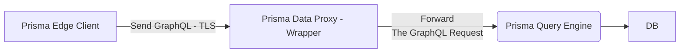

# prisma-data-proxy-windmill-template

Use Prisma Data Proxy in serverless env, like Windmill, Tencent SCF , AWS Lambda etc.

[What's Prisma Data Proxy?](https://www.prisma.io/docs/data-platform/data-proxy)

> Serverless functions are ephemeral and short-lived, so their database connections are numerous and brief. Because of this, using traditional databases in serverless environments often leads to the exhaustion of the maximum number of concurrent database connections and increased latencies when each request needs to establish a database connection.
>
>The Data Proxy in Prisma Data Platform provides database connection management and pooling, load balancing, scaling, and fault tolerance so that you can manage and scale database connections for applications that run with Prisma ORM in serverless environments. With the Data Proxy, your application can scale and maintain predictable database performance because it also limits the total number of database connections.
>
>Designed specifically with serverless functions in mind, the Data Proxy provides a wide range of benefits for applications that run in serverless and edge environments.

## Features

1. Self-hosted - Low Latency
2. Out-of-the-box GitHub Action

## TLDR

1. Fork this repo
2. Change Prisma Schema and push them to github
3. The Github Action will auto build
    - the deno client - [Branch deno-client](https://github.com/zsnmwy/prisma-data-proxy-windmill-template/tree/deno-client)
    - `ghcr.io/${{ github.actor }}/prisma-data-proxy-windmill-template:${{ env.package_version }}` - [Docker image / GHCR Registry](https://github.com/users/zsnmwy/packages/container/package/prisma-data-proxy-windmill-template)
    - `ghcr.io/${{ github.actor }}/prisma-migrate-db-windmill-template:${{ env.package_version }}` - [Docker image / GHCR Registry](https://github.com/users/zsnmwy/packages/container/package/prisma-migrate-db-windmill-template)
4. Deploy The Prisma Data Proxy
   - [docker compose](https://github.com/zsnmwy/prisma-data-proxy-windmill-template/blob/master/docker-compose-prod.yml)
   - [k8s](https://github.com/zsnmwy/prisma-data-proxy-windmill-template/blob/master/k8s/prisma-data-proxy/values.yaml)
5. Connect to Prisma Data Proxy with Deno

```ts
import {
  Prisma,
  PrismaClient,
} from "https://cdn.jsdelivr.net/gh/zsnmwy/prisma-data-proxy-windmill-template@deno-client/0.0.3/deno/edge.ts"; // Change to your deno client

// TIPS
// https://cdn.jsdelivr.net/gh/user/repo@version/file

type PrismaDataProxy = {
  url: string;
};

export async function main(
  prismaDataProxy: PrismaDataProxy,
) {
  const prisma = new PrismaClient({
    datasources: { db: { url: prismaDataProxy.url } }
  })
  const createUser = await prisma.user.create({
    data: {
      email: "123@gmail.com",
      name: "123",
    }
  });
  console.log(createUser)

  const fetchUser = await prisma.user.findMany();
  console.log(fetchUser);
}
```

OR

```ts
import {
  PrismaClient,
} from "https://cdn.jsdelivr.net/gh/zsnmwy/prisma-data-proxy-windmill-template@deno-client/0.0.3/deno/edge.ts"; // Change to your deno client

export async function main() {
  console.log(Deno.env.get("DATABASE_URL"));

  const prisma = new PrismaClient();
  const createUser = await prisma.user.create({
    data: {
      email: "123@gmail.com",
      name: "123",
    }
  });
  console.log(createUser)

  const fetchUser = await prisma.user.findMany();
  console.log(fetchUser);
}
```

## Manual

1. [Change the Prisma Schema](https://www.prisma.io/docs/concepts/components/prisma-schema) - [prisma/schema.prisma](https://github.com/zsnmwy/prisma-data-proxy-windmill-template/blob/master/prisma/schema.prisma)
2. Build Client, [Makefile - make-client](https://github.com/zsnmwy/prisma-data-proxy-windmill-template/blob/bb087d0c52418d8a4a2a3ddb9e65d3c6ce77a9c9/makefile#L9-L18)
3. Build Image
    - [prisma-migrate-db](https://github.com/zsnmwy/prisma-data-proxy-windmill-template/blob/master/Dockerfile-db-deploy)
    - [prisma-data-proxy](https://github.com/zsnmwy/prisma-data-proxy-windmill-template/blob/master/Dockerfile)
4. Prepare TLS for prisma data proxy. You may need reverse proxy, like [Caddy](https://caddyserver.com/), Nginx, [Apache APISIX](https://apisix.apache.org/) .etc.
5. Start Migrate DB - Check the database version first and migrate to latest version.
6. Start Prisma Data Proxy - Accept the Prisma Client Requests.

## Detail Flow



### Prisma Edge Client

1. Write the Prisma Schema.

2. Build the Deno Client base on the schema. `yarn prisma generate --data-proxy`

3. Send GraphQL To Prisma Data Proxy - HTTPS Connect

### Prisma Data Proxy

1. Prisma Data Proxy starts a Prisma Query Engine base on config. Make it listen on the specific port.

```ts
/app/query-engine --datamodel-path ./prisma/schema.prisma --host 0.0.0.0 --enable-playground --port 4467 --enable-raw-queries --enable-metrics --dataproxy-metric-override --enable-telemetry-in-response
```

2. Prisma Query Engine will parse the Prisma schema and builds the GraphQL schema.

3. Prisma Data Proxy will accept requests from the Prisma Edge Client.It will check the requested permission. Then forward the request to Prisma Query Engine.

4. [Configuration](https://github.com/zsnmwy/prisma-data-proxy/blob/ba921e61c116ae382f446c78915fa38987416c10/main.go#L19-L60)

### Prisma Query Engine

Accept the request - GraphQL from Prisma Data Proxy. Query DB and return data.

Prisma Client Edge does **not support some Prisma features**. Like metrics.
That means we need to remove the unsupported features when we build the client.

Deno Client needs to rebuild on each DB version. And push them to S3.

```log
prisam-data-proxy-prisma-data-proxy-6bdfcfb6f5-pkwfp:/app# ./query-engine -h
query-engine 4bc8b6e1b66cb932731fb1bdbbc550d1e010de81

USAGE:
    query-engine [FLAGS] [OPTIONS] [SUBCOMMAND]

FLAGS:
        --dataproxy-metric-override       
    -d, --debug                           Enables server debug features
    -m, --enable-metrics                  Enables the metrics endpoints
        --enable-open-telemetry           Enable OpenTelemetry streaming from requests
    -g, --enable-playground               Enables the GraphQL playground
    -r, --enable-raw-queries              Enables raw SQL queries with executeRaw/queryRaw mutation
        --enable-telemetry-in-response    Enable tracer to capture logs and traces and return in the response
    -h, --help                            Prints help information
    -o, --log-queries                     Enable query logging [env: LOG_QUERIES=y]
    -V, --version                         Prints version information

OPTIONS:
        --datamodel <datamodel>                                Base64 encoded Prisma datamodel [env: PRISMA_DML=]
        --datamodel-path <datamodel-path>                      Path to the Prisma datamodel file [env: PRISMA_DML_PATH=]
        --engine-protocol <engine-protocol>
            The protocol the Query Engine will used. Affects mostly the request and response format [env:
            PRISMA_ENGINE_PROTOCOL=]
    -H, --host <host>
            The hostname or IP the query engine should bind to [default: 127.0.0.1]

        --log-format <log-format>                              Set the log format [env: RUST_LOG_FORMAT=]
        --open-telemetry-endpoint <open-telemetry-endpoint>
            The url to the OpenTelemetry collector. Enabling this will send the OpenTelemtry tracing to a collector and
            not via our custom stdout tracer [default: ]
        --overwrite-datasources <overwrite-datasources>
            Base64 encoded datasource urls, overwriting the ones in the schema [env: OVERWRITE_DATASOURCES=]

    -p, --port <port>                                          The port the query engine should bind to [default: 4466]
    -u, --unix-path <unix-path>                                The unix socket path to listen on [env: UNIX_PATH=]

SUBCOMMANDS:
    cli     Doesn't start a server, but allows running specific commands against Prisma
    help    Prints this message or the help of the given subcommand(s)
```

### Prisma Migration Engine

The Prisma Migration Engine binary is not good for users. [So I build another Nodejs image to migrate and track the database.](https://github.com/zsnmwy/prisma-data-proxy-windmill-template/blob/master/Dockerfile-db-deploy)

```log
prisam-data-proxy-prisma-data-proxy-6bdfcfb6f5-pkwfp:/app# ./migration-engine -h
schema-engine-cli 4bc8b6e1b66cb932731fb1bdbbc550d1e010de81
When no subcommand is specified, the schema engine will default to starting as a JSON-RPC server over stdio

USAGE:
    migration-engine [OPTIONS] [SUBCOMMAND]

FLAGS:
    -h, --help       Prints help information
    -V, --version    Prints version information

OPTIONS:
    -d, --datamodel <FILE>    Path to the datamodel

SUBCOMMANDS:
    cli     Doesn't start a server, but allows running specific commands against Prisma
    help    Prints this message or the help of the given subcommand(s)
```


### K8S Deployment

1. Check the database version first and migrate to latest version.

Init Container - init-db-migrate-deploy

2. Start Prisma Data Proxy

Main Container - prisma-data-proxy

```yaml
initContainers:
  - name: init-db-migrate-deploy // Check the database version first and migrate to latest version.
    image: "{{ .Values.migrate_image.repository }}:{{ .Values.migrate_image.tag | default .Chart.AppVersion }}"
    env:
      {{- range .Values.app }}
      - name: {{ .name }}
        value: "{{ .value }}"
      {{- end }}
containers:
  - name: {{ .Chart.Name }} // Start Prisma Data Proxy
    image: "{{ .Values.image.repository }}:{{ .Values.image.tag | default .Chart.AppVersion }}"
```


## Metrics

Prisma Query Engine export metrics about performance.

Fetch the query engine port and path /metrics. `127.0.0.1:4467/metrics`

```
# HELP prisma_client_queries_total Total number of Prisma Client queries executed
# TYPE prisma_client_queries_total counter
prisma_client_queries_total 442

# HELP prisma_datasource_queries_total Total number of Datasource Queries executed
# TYPE prisma_datasource_queries_total counter
prisma_datasource_queries_total 1780

# HELP prisma_pool_connections_closed_total Total number of Pool Connections closed
# TYPE prisma_pool_connections_closed_total counter
prisma_pool_connections_closed_total 9

# HELP prisma_pool_connections_open Number of currently open Pool Connections
# TYPE prisma_pool_connections_open counter
prisma_pool_connections_open 11

# HELP prisma_client_queries_active Number of currently active Prisma Client queries
# TYPE prisma_client_queries_active gauge
prisma_client_queries_active 0

# HELP prisma_client_queries_wait Number of queries currently waiting for a connection
# TYPE prisma_client_queries_wait gauge
prisma_client_queries_wait 0

# HELP prisma_pool_connections_busy Number of currently busy Pool Connections (executing a database query)
# TYPE prisma_pool_connections_busy gauge
prisma_pool_connections_busy 0

# HELP prisma_pool_connections_idle Number of currently unused Pool Connections (waiting for the next pool query to run)
# TYPE prisma_pool_connections_idle gauge
prisma_pool_connections_idle 17

# HELP prisma_pool_connections_open Number of currently open Pool Connections
# TYPE prisma_pool_connections_open gauge
prisma_pool_connections_open -9

# HELP prisma_pool_connections_opened_total Total number of Pool Connections opened
# TYPE prisma_pool_connections_opened_total gauge
prisma_pool_connections_opened_total 11

# HELP prisma_client_queries_duration_histogram_ms Histogram of the duration of all executed Prisma Client queries in ms
# TYPE prisma_client_queries_duration_histogram_ms histogram
prisma_client_queries_duration_histogram_ms_bucket{le="0"} 0
prisma_client_queries_duration_histogram_ms_bucket{le="1"} 0
prisma_client_queries_duration_histogram_ms_bucket{le="5"} 11
prisma_client_queries_duration_histogram_ms_bucket{le="10"} 202
prisma_client_queries_duration_histogram_ms_bucket{le="50"} 442
prisma_client_queries_duration_histogram_ms_bucket{le="100"} 442
prisma_client_queries_duration_histogram_ms_bucket{le="500"} 442
prisma_client_queries_duration_histogram_ms_bucket{le="1000"} 442
prisma_client_queries_duration_histogram_ms_bucket{le="5000"} 442
prisma_client_queries_duration_histogram_ms_bucket{le="50000"} 442
prisma_client_queries_duration_histogram_ms_bucket{le="+Inf"} 442
prisma_client_queries_duration_histogram_ms_sum 5000.248393
prisma_client_queries_duration_histogram_ms_count 442

# HELP prisma_client_queries_wait_histogram_ms Histogram of the wait time of all queries in ms
# TYPE prisma_client_queries_wait_histogram_ms histogram
prisma_client_queries_wait_histogram_ms_bucket{le="0"} 0
prisma_client_queries_wait_histogram_ms_bucket{le="1"} 53
prisma_client_queries_wait_histogram_ms_bucket{le="5"} 53
prisma_client_queries_wait_histogram_ms_bucket{le="10"} 53
prisma_client_queries_wait_histogram_ms_bucket{le="50"} 53
prisma_client_queries_wait_histogram_ms_bucket{le="100"} 53
prisma_client_queries_wait_histogram_ms_bucket{le="500"} 53
prisma_client_queries_wait_histogram_ms_bucket{le="1000"} 53
prisma_client_queries_wait_histogram_ms_bucket{le="5000"} 53
prisma_client_queries_wait_histogram_ms_bucket{le="50000"} 53
prisma_client_queries_wait_histogram_ms_bucket{le="+Inf"} 53
prisma_client_queries_wait_histogram_ms_sum 0.28805
prisma_client_queries_wait_histogram_ms_count 53

# HELP prisma_datasource_queries_duration_histogram_ms Histogram of the duration of all executed Datasource Queries in ms
# TYPE prisma_datasource_queries_duration_histogram_ms histogram
prisma_datasource_queries_duration_histogram_ms_bucket{le="0"} 0
prisma_datasource_queries_duration_histogram_ms_bucket{le="1"} 76
prisma_datasource_queries_duration_histogram_ms_bucket{le="5"} 1717
prisma_datasource_queries_duration_histogram_ms_bucket{le="10"} 1763
prisma_datasource_queries_duration_histogram_ms_bucket{le="50"} 1780
prisma_datasource_queries_duration_histogram_ms_bucket{le="100"} 1780
prisma_datasource_queries_duration_histogram_ms_bucket{le="500"} 1780
prisma_datasource_queries_duration_histogram_ms_bucket{le="1000"} 1780
prisma_datasource_queries_duration_histogram_ms_bucket{le="5000"} 1780
prisma_datasource_queries_duration_histogram_ms_bucket{le="50000"} 1780
prisma_datasource_queries_duration_histogram_ms_bucket{le="+Inf"} 1780
prisma_datasource_queries_duration_histogram_ms_sum 3760.415455000001
prisma_datasource_queries_duration_histogram_ms_count 1780
```